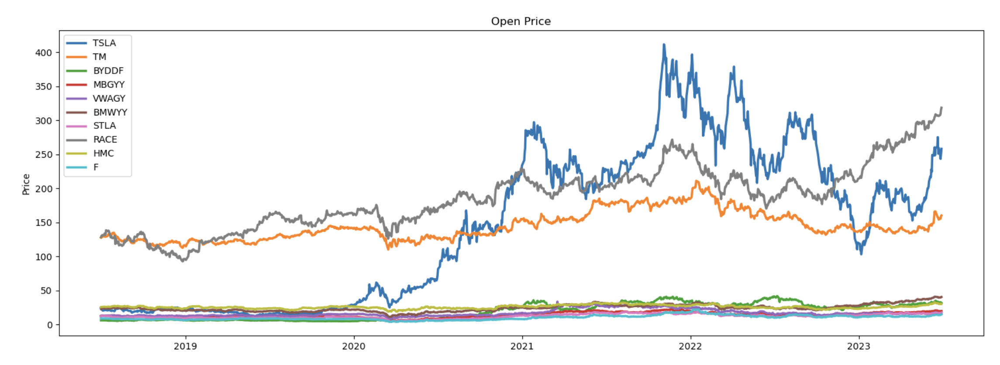
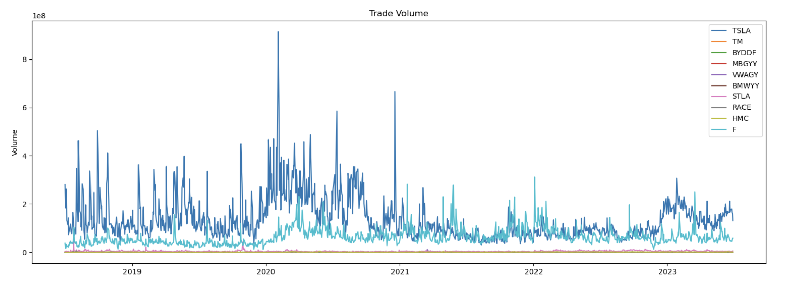
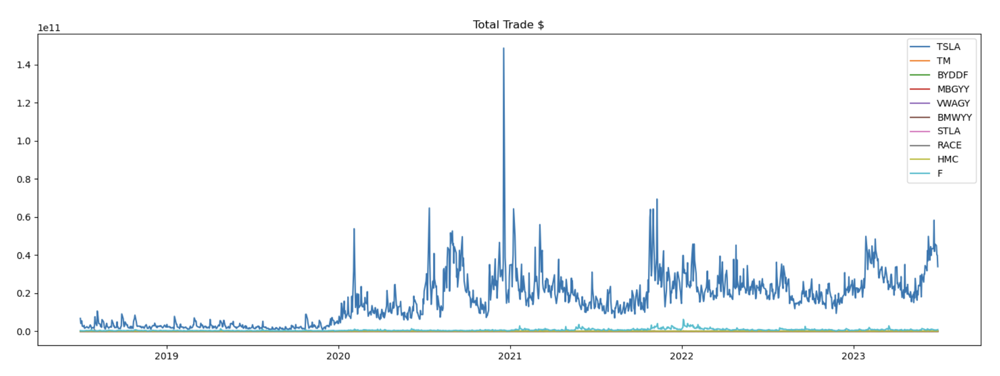
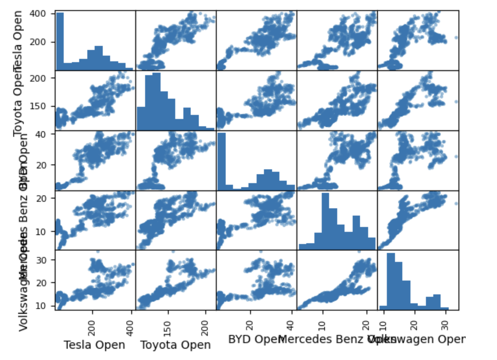
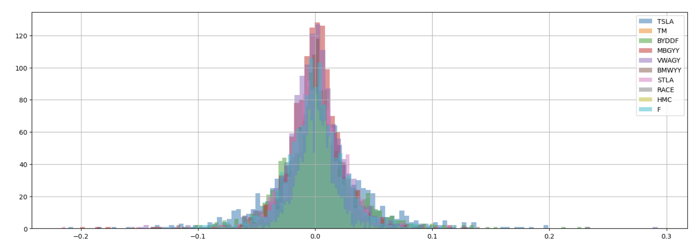
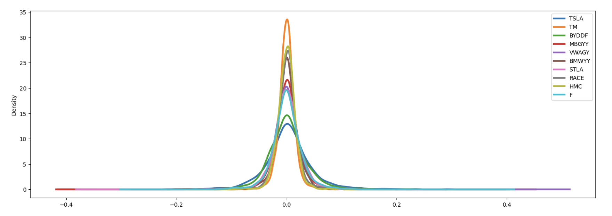
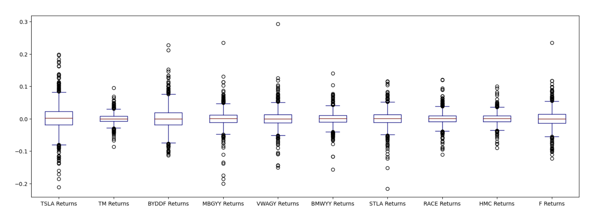
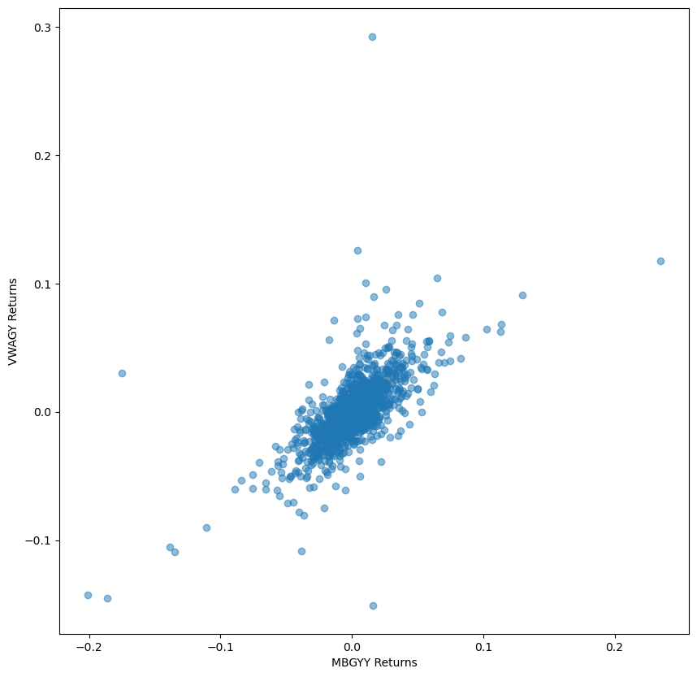
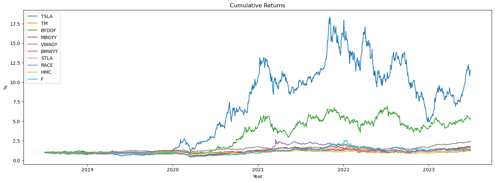

# automotive-5year-stock-analysis

This is a 5-year stock market analysis on top 20 major automotive industry companies' stock market (based on Total Marke Capitalization as of June 30, 2023, including US stock market and OTC), from July 1 2018 to June 30 2023 using <b> yfinance, matplotlib, pandas, datetime and numpy.</b>

## Source Data
Over 25,000 data records were extracted from yfinance and can be accessed both locally from .csv files under /source_data or access directly online.

## Visualization
Basic visualization of open price, daily volume and total traded $ amount.

Any special values / outliers were identified and inspected.

Furthermore, a better tendency and correlation was visualized using moving averages and scatter matrix.

## Financial Analysis 
Return Volatility was identified using histogram, kde graph, box plot.

Return Correlation was identified using matrix.

A Cumulative Return was generated to show overall performance.

## Please run and edit the jupyter notebook for interactive results