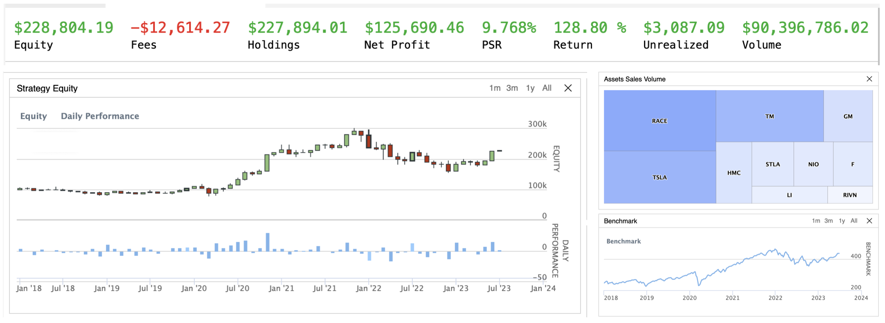
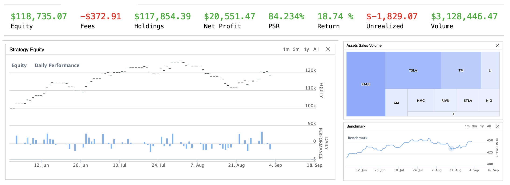
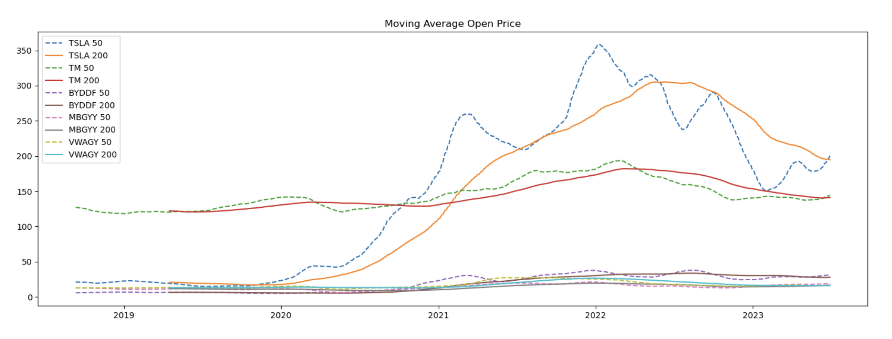
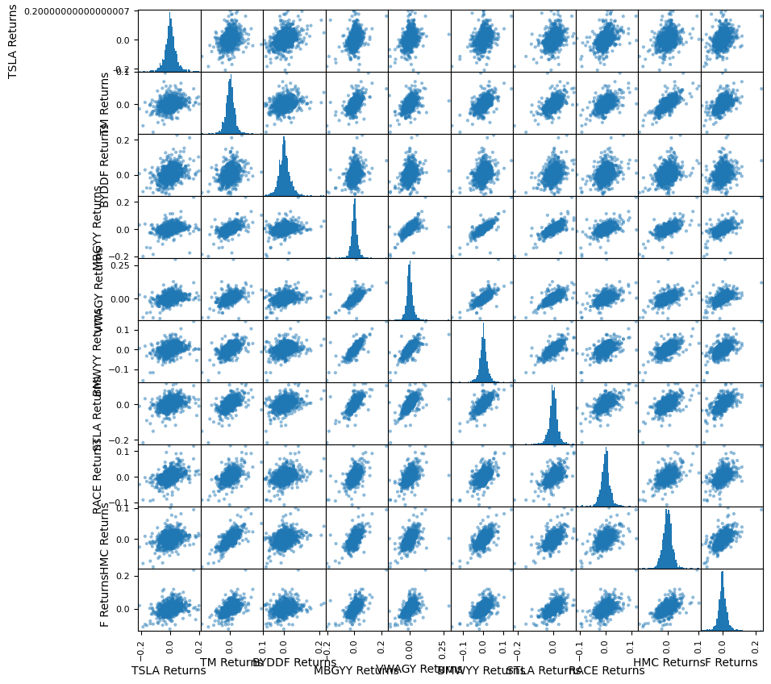

# automotive-5year-stock-trading

## Summary
* Analyzed and visualized top 20 major automotive industry companies' stock market (based on Total Marke Capitalization as of June 30, 2023, including US stock market and OTC) from July 1 2018 using <b>yfinance, numpy, pandas and matplotlib.</b>

* Developed and optimized an algorithmic trading strategy, with weighted consideration of:
    - Financial indicators(Exponential Moving Averages(EMA), Moving Average Convergence Divergence (MACD) and Relative Strength Index (RSI))
    - Sentimental analysis using Tiingo News Feed API and Vader analyzer
    - Machine learning predictions using RandomForestRegressor

* Achieved a <b>128.80%</b> return during a 5-year backtesting and realized a <b>18.74%</b> return during a 3-month live trading deployment

## Pre-Trading Research Source Data
Over 25,000 data records were extracted from yfinance and can be accessed both locally from .csv files under /source_data or access directly online.

## Data Visualization and Financial Analysis 
Basic visualization of open price, daily volume and total traded $ amount.

Any special values / outliers were identified and inspected.

Furthermore, a better tendency and correlation was visualized using moving averages and scatter matrix.

Return Volatility was identified using histogram, kde graph, box plot.

Return Correlation was identified using matrix.

A Cumulative Return was generated to show overall performance.

## Run and edit the jupyter notebook for interactive results

## Find trading algorithm in trading_algo folder